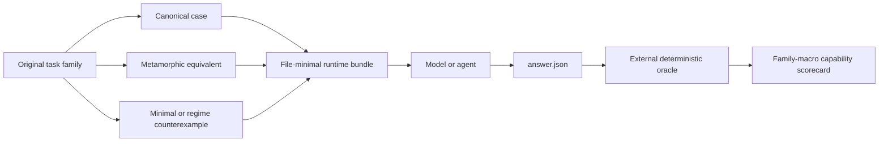

# EvoLDO-Bench

> An original, auditable benchmark for testing whether an AI model or agent can actually reason about
> LDO circuits, use tools responsibly, and progress toward design closure.

[](https://github.com/jialinlu/ldo_benchmark_for_agent/actions/workflows/ci.yml)

## Why this repository exists

A fluent answer is not the same as analog design competence. An LDO agent may know the vocabulary
while still getting the feedback sign wrong, changing two variables in a “controlled” sweep, treating
a license failure as a circuit failure, copying planar W/L into a FinFET PDK, or claiming success from
stale simulation evidence.

EvoLDO-Bench turns those failure modes into explicit, repeatable tests. Its purpose is to answer:

- Does the model read the circuit that is actually present?
- Does it state the operating regime and held-fixed conditions before claiming a trend?
- Can it separate circuit, measurement, bench, parser, PDK, license, and tool failures?
- Can it choose a role-aware sizing space and explain multi-objective tradeoffs?
- Does an LDO skill or simulator produce measurable lift, or only longer answers and more tool calls?
- Can the same capability contract be replayed on a restricted offline agent and a private PDK?

The long-term product has two layers:

- **EvoLDO-Bench**: evolving contracts, runners, graders, public development tasks, and research tools.
- **EvoLDO-Exam**: a frozen, sealed release with hidden task families, fixed budgets, fixed tool snapshots,
  and a formal scorecard.

## Current milestone: public Phase 0 + Phase 1 MVP

This repository currently delivers a runnable **public development set**, not a sealed exam and not a
public leaderboard.

| Item | Current status |
|---|---|
| Original task families | 12 |
| Public development instances | 36 |
| Variants per family | canonical + metamorphic + minimal/regime counterexample |
| Capability levels | L1–L3 development coverage |
| Suites | structure, trend, diagnosis, sizing, migration, system impact, design-closure diagnosis |
| Runtime | Python 3.9+, standard-library-only |
| Runner modes | direct, skill, simulation, full-design, weak-agent contracts |
| Automatic grader | deterministic facts, controlled relations, actions, critical caps |
| Isolation | file-minimal runtime bundle; external container required for hostile agents |
| Contamination checks | family split, forbidden files, oracle identity, lexical near-duplicate guardrail |
| Real PDK design closure | adapter contract planned; not claimed by this release |
| Sealed exam | planned; hidden tasks/oracles are not in this public repository |

A score on `dev` measures integration and public-task performance only. It must not be presented as an
EvoLDO-Exam result.

## Benchmark design



### Why task families matter

A benchmark is easy to game if a node rename creates a “new” question or if an easy equivalent drawing
can dilute a difficult failure case. EvoLDO-Bench therefore groups all variants under one `family_id`
and computes the headline score as a macro-average across families.

Each current family contains:

1. a canonical case;
2. a metamorphic equivalent that should preserve the conclusion;
3. a counterexample that changes one important fact, regime, or held-fixed condition and should change
   the answer when the physics changes.

Family lineage is a hard split boundary: variants from one family may not be scattered across training,
development, and sealed exam sets.

### Current original families

| Family | Suite | What it tests |
|---|---|---|
| `structure_feedback_sign` | structure | PMOS pass polarity plus error-amplifier action |
| `structure_pass_body` | structure | high-side PMOS body connectivity |
| `structure_floating_bias` | structure | real DC bias path versus gate-only floating node |
| `trend_compensation_cap` | trend | phase-margin/bandwidth/settling tradeoff and confounding |
| `trend_pass_size_turning` | trend | dropout benefit versus pass-gate pole and driver strength |
| `trend_divider_current` | trend | noise, accuracy, loading, and IQ tradeoff |
| `diagnosis_infra_vs_circuit` | diagnosis | license failure versus a disabled bench |
| `diagnosis_wrong_probe` | diagnosis | invalid STB probe versus real instability |
| `sizing_role_aware_space` | sizing | legal, coupled parameter selection by device role |
| `migration_planar_to_finfet` | migration | intent/OP migration versus literal W/L copying |
| `system_noise_sensitivity` | system impact | LDO noise propagation to a downstream block |
| `design_closure_cold_start` | design closure | physical startup path versus ideal/unsupported fixes |

These tasks and their fixtures were independently authored for this project. No external benchmark task,
golden, figure, rubric, netlist, or model output is included.

## Quick start

```bash
git clone https://github.com/jialinlu/ldo_benchmark_for_agent.git
cd ldo_benchmark_for_agent
python3 -m venv .venv
source .venv/bin/activate
python -m pip install -e .

# Inventory and validate the public development set.
evoldo-bench list
evoldo-bench validate
evoldo-bench audit

# Run repository-level tests and deterministic infrastructure self-check.
python -m unittest discover -s tests -v
python tools/run_self_check.py
```

The package has no runtime dependency outside the Python standard library. JSON Schema files are
included for interoperability, while the reference CLI performs its own strict contract validation.

## Run one task

### 1. Build a runtime bundle

```bash
evoldo-bench bundle structure_feedback_sign--canonical \
  --output /tmp/evoldo-task
```

Only the public task, prompt, inputs, answer template, and bundle hashes are copied. The oracle is not
included.

### 2. Let an agent write `answer.json`

An agent command receives:

```text
EVOLDO_TASK_DIR=/path/to/run/app
EVOLDO_ANSWER_PATH=/path/to/run/app/answer.json
EVOLDO_TASK_ID=<task-id>
EVOLDO_MODE=<mode>
```

Run it with:

```bash
evoldo-bench run structure_feedback_sign--canonical \
  --output runs/example \
  --mode direct_reasoning \
  -- python /absolute/path/to/your_agent.py
```

The command is passed as an argument vector, not through a shell. The reference runner records stdout,
stderr, duration, task hashes, environment, repository commit, answer hash, and timeout status.

### 3. Grade outside the agent runtime

```bash
evoldo-bench grade runs/example/app/answer.json \
  --oracle-root benchmarks/ldo_original/dev_reference/oracles \
  --output runs/example/score.json
```

Public `dev_reference` oracles exist so contributors can test the infrastructure. A formal exam must
supply `--oracle-root` from an external private store that the agent process cannot access.

### 4. Aggregate a run

```bash
evoldo-bench grade-dir runs/my-model \
  --scores-root runs/my-model-scores

evoldo-bench aggregate runs/my-model-scores \
  --mode direct_reasoning \
  --output runs/direct-report.json \
  --markdown runs/direct-report.md
```

Paired treatment lift can be computed with:

```bash
evoldo-bench paired-lift \
  --direct runs/direct-report.json \
  --skill runs/skill-report.json \
  --simulation runs/simulation-report.json
```

## Answer contract

Agents return concise engineering conclusions, not hidden chain-of-thought:

```json
{
  "schema_version": "1.0",
  "task_id": "structure_feedback_sign--canonical",
  "conclusion": "negative_feedback",
  "analysis_regime": "small_signal",
  "held_fixed": ["pmos_polarity", "error_amplifier_gain_sign", "supply_and_load"],
  "evidence_facts": ["pmos_gate_falls_when_output_is_low"],
  "mechanism_tags": ["loop_restores_output"],
  "recommended_actions": ["verify_loop_gain_with_correct_break_point"],
  "mechanism": "A lower PMOS gate voltage increases pass current and restores VOUT.",
  "claim_boundary": "Loop sign only; phase margin still requires a valid loop-gain measurement.",
  "confidence": 0.9,
  "numeric_results": {}
}
```

Controlled tokens make deterministic grading possible. `mechanism` and `claim_boundary` remain visible,
engineer-facing prose. They are contract-required but this MVP does not claim that an uncalibrated LLM
judge can score them reliably.

## Scoring

Each public development oracle contains checks totaling 100 points:

- task identity: 5;
- final conclusion: 30;
- analysis regime: 10;
- held-fixed conditions: 10;
- evidence facts: 15;
- mechanism tags: 15;
- recommended next actions: 10;
- forbidden-action exclusion: 5.

A critical conclusion, identity, or forbidden-action failure caps the task score at 49. Reports expose:

- family-macro score;
- suite and level vectors;
- canonical/metamorphic/counterexample consistency;
- critical-failure counts;
- pass rate and rollout variation when multiple runs are supplied;
- paired skill and simulation lift.

The family-macro score is a summary, not a substitute for the capability vector.

## Tool-assisted reasoning contract

Before using a simulator or EDA tool, an agent should emit an `AnalogProbeContract` containing:

- the exact question;
- operating regime;
- held-fixed variables;
- intervention and measurement;
- whether evidence will support, falsify, or disambiguate;
- stop condition;
- claim boundary.

See [`schemas/analog_probe_contract.schema.json`](schemas/analog_probe_contract.schema.json). Phase 2 will
enforce this contract at tool-call time and compute simulation lift and simulation-harm rate.

## Security and honest claims

The reference runner creates a **file-minimal bundle**, but it is not a hostile-code sandbox. A process
running on the host may still read other host paths if the operating system allows it. Sealed exams must
run the agent in a container, VM, or site-controlled sandbox that mounts only the task bundle, approved
skill snapshot, and approved tools.

Likewise:

- public development oracles are not hidden exam oracles;
- a fixture-backed score is not evidence of private-PDK performance;
- simulator/license failure is not a circuit zero;
- a judge cannot replace fresh EDA qualification;
- nodeset, forced IC, ideal bias, and invented model decks cannot count as final DUT fixes.

See [`docs/SECURITY_AND_CONTAMINATION.md`](docs/SECURITY_AND_CONTAMINATION.md).
The repository itself is also checked by the
[`public-release security gate`](docs/PUBLIC_RELEASE_SECURITY.md), including reachable Git history and
commit metadata.

## Repository layout

```text
benchmarks/ldo_original/     original public dev tasks and isolated dev-reference oracles
schemas/                     task, answer, oracle, probe, and score contracts
src/evoldo_bench/            discovery, bundling, runner, grading, aggregation, audit
scripts/                     compatibility entry points
tools/                       deterministic task generator and self-check
tests/                       unit and end-to-end tests
docs/                        architecture, authoring, security, exam, and roadmap
```

## Roadmap

1. **Phase 0/1 — current:** contracts, 12 families, 36 instances, deterministic grading and audit.
2. **Phase 2:** frozen skill and simulator treatments, enforced probe contracts, repeated rollouts.
3. **Phase 3:** 40-family controlled pilot, calibrated explanation judges, sealed test split.
4. **Phase 4:** hardware-backed design closure with public and site-specific PDK adapters.
5. **Phase 5:** 80-family v1.0 and a frozen EvoLDO-Exam release.

Detailed gates are in [`docs/ROADMAP.md`](docs/ROADMAP.md). Unfinished phases are intentionally marked;
this project does not convert planned interfaces into performance claims.

## Licensing and external references

- Software: Apache-2.0, see [`LICENSE`](LICENSE).
- Original public benchmark materials: CC BY 4.0, see [`BENCHMARK_LICENSE.md`](BENCHMARK_LICENSE.md).
- Clean-room boundary and external references: [`THIRD_PARTY_NOTICES.md`](THIRD_PARTY_NOTICES.md).

## Contributing

New task families must be original, family-grouped, deterministic where possible, reviewed for physical
correctness, and accompanied by canonical/metamorphic/counterexample cases plus tests. Read
[`docs/AUTHORING_GUIDE.md`](docs/AUTHORING_GUIDE.md) before submitting changes.
