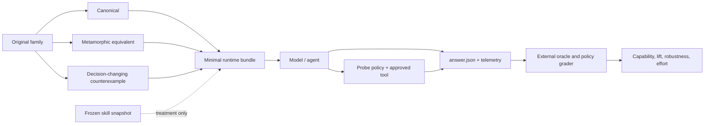

# EvoLDO-Bench

> An original, auditable benchmark for testing whether an AI model or agent can reason about LDOs,
> use simulation evidence responsibly, and move a design toward real closure.

[](https://github.com/jialinlu/ldo_benchmark_for_agent/actions/workflows/ci.yml)

## Why this exists

Fluent analog vocabulary is not analog design competence. An LDO agent can still reverse the loop sign,
change two variables in a “controlled” sweep, confuse a tool failure with a circuit failure, copy geometry
between incompatible processes, or qualify a new candidate using stale results.

EvoLDO-Bench turns those failure modes into replayable tests. It asks whether an agent can:

- read the circuit and operating regime that are actually present;
- separate structure, bias, stability, startup, measurement, tool, model, and bench failures;
- state what is held fixed before claiming causality;
- choose coupled sizing and architecture actions rather than one-knob guesses;
- use a simulator only through an explicit probe contract;
- produce measurable capability lift per token, tool call, dollar, and minute;
- preserve the same evidence discipline on an offline agent or a private PDK.

The project has two layers:

- **EvoLDO-Bench** evolves public contracts, development tasks, runners, graders, and research tooling.
- **EvoLDO-Exam** is the future frozen release: hidden families, fixed budgets, immutable skills/tools,
  isolated execution, calibrated judges, and formal sign-off.

## Current release

This repository now contains a **40-family / 120-instance controlled reasoning pilot** plus **six real
SKY130/ngspice LDO design-closure tasks**. It is not a sealed exam. The public-PDK circuit is a benchmark
fixture, not a silicon or product-performance claim.

| Capability | Implemented now |
|---|---|
| Original task corpus | 40 families, each with canonical, metamorphic, and counterexample instances |
| Coverage | structure, trend, diagnosis, sizing, migration, system impact, design closure, architecture choice |
| Difficulty | L1–L4 development coverage |
| Grading | deterministic checks, critical caps, family-macro and capability vectors |
| Repeated experiments | fixed seeds, multiple rollouts, immutable context snapshots, command-model adapter |
| Treatment control | comparator for model/task/seed/budget/answer-contract equality |
| Tool policy | enforced `AnalogProbeContract`, regime/artifact/confounding checks, tool ledger and budget |
| Simulator adapters | JSON process protocol, optional ngspice batch adapter, analytic protocol fixture |
| Efficiency metrics | Pass@1 + 95% CI, spec score, tokens, cache share, steps, calls, time, cost |
| Lift metrics | skill lift, simulation lift, simulation harm, ineffective-probe rate |
| Result publishing | JSON, Markdown, CSV, and static score-versus-effort HTML |
| Exam operations | freeze/verify manifests for tasks, oracles, skills, tools, policy, and code revision |
| Explanation judging | two-judge calibration and automatic human-review routing on disagreement |
| Design closure | immutable candidate and fresh-evidence hard gates for OP through PVT/policy |
| Real public-PDK track | six fault-injected SKY130 transistor tasks with pinned model provenance and CI replay |
| Private PDK | out-of-tree `SiteAdapter` boundary; no private assets belong in this repository |

A `dev` score measures public-task integration and public-task performance only. It must never be called
an EvoLDO-Exam score.

## Benchmark structure



The scored unit is a **family**, not an isolated prompt. Renaming nodes must not create free points, while
changing one physical or evidential fact must change the answer when the physics changes. All related
variants remain in one lineage and one split.

All included LDO tasks, fixtures, controlled tokens, and development oracles were independently authored
for this project. No external benchmark task, netlist, golden, rubric, judge prompt, or model output is
included.

## Quick start

```bash
git clone https://github.com/jialinlu/ldo_benchmark_for_agent.git
cd ldo_benchmark_for_agent
python3 -m venv .venv
source .venv/bin/activate
python -m pip install -e .

evoldo-bench list
evoldo-bench validate
evoldo-bench audit
python -m unittest discover -s tests -v
python tools/run_self_check.py
```

The runtime is Python 3.9+ and standard-library-only. JSON Schemas are included for interoperability;
the CLI also performs strict native validation.

## Run and grade one task

```bash
evoldo-bench run structure_feedback_sign--canonical \
  --output runs/example --mode direct_reasoning -- \
  python /absolute/path/to/your_agent.py

evoldo-bench grade runs/example/app/answer.json \
  --oracle-root benchmarks/ldo_original/dev_reference/oracles \
  --output runs/example/score.json
```

The agent receives `EVOLDO_TASK_DIR`, `EVOLDO_ANSWER_PATH`, `EVOLDO_TELEMETRY_PATH`,
`EVOLDO_TOOL_LEDGER_PATH`, `EVOLDO_TASK_ID`, and `EVOLDO_MODE`. Public development oracles are outside
the runtime bundle. A formal exam keeps its oracle store outside both the repository and agent sandbox.

## Run controlled treatments

Use the same `--model-id`, task set, rollout count, and seed policy for every treatment:

```bash
# Direct reasoning.
evoldo-bench experiment --output runs/direct --model-id my-model \
  --mode direct_reasoning --rollouts 3 --base-seed 2026 \
  --paired-modes direct_reasoning,agentic_skill,simulation_assisted -- \
  python /absolute/path/to/agent.py

# Same model and seeds, now with a frozen skill/context snapshot.
evoldo-bench experiment --output runs/skill --model-id my-model \
  --mode agentic_skill --rollouts 3 --base-seed 2026 \
  --paired-modes direct_reasoning,agentic_skill,simulation_assisted \
  --context-dir /absolute/path/to/skill_snapshot -- \
  python /absolute/path/to/agent.py

# Same model, seeds, and skill, now with the approved simulator gateway available.
evoldo-bench experiment --output runs/simulation --model-id my-model \
  --mode simulation_assisted --rollouts 3 --base-seed 2026 \
  --paired-modes direct_reasoning,agentic_skill,simulation_assisted \
  --context-dir /absolute/path/to/skill_snapshot -- \
  python /absolute/path/to/agent.py

# Verify that the paired comparison is controlled.
evoldo-bench compare-treatments \
  runs/direct/experiment_manifest.json runs/skill/experiment_manifest.json \
  runs/simulation/experiment_manifest.json

# Build scorecards.
evoldo-bench experiment-report runs/direct --output runs/direct.json --markdown runs/direct.md
evoldo-bench experiment-report runs/skill  --output runs/skill.json  --markdown runs/skill.md
evoldo-bench experiment-report runs/simulation --output runs/simulation.json --markdown runs/simulation.md
evoldo-bench paired-lift --direct runs/direct.json --skill runs/skill.json --simulation runs/simulation.json
```

An adapter may write detailed token/cost telemetry to `EVOLDO_TELEMETRY_PATH`. Runner timing and identity
are authoritative; provider token/cost fields are only as trustworthy as the frozen adapter that reports
them. Tool calls must also appear in the ledger or the rollout is a policy failure.

## Tool-assisted reasoning

Every approved simulator call begins with an `AnalogProbeContract`: question, regime, held-fixed variables,
intervention, measurement, intended evidence use, stop condition, and claim boundary.

```bash
evoldo-bench validate-probe probe.json --task-id trend_compensation_cap--canonical

evoldo-bench simulate-probe examples/simulators/rc_probe_request.json \
  --workspace /tmp/evoldo-sim \
  --simulator-command python /absolute/path/to/analytic_probe_simulator.py
```

The gate detects wrong regimes, unrelated probes, confounded sweeps, held-fixed violations, invented
artifacts, and measurement/regime mismatches. Unavailable executables, timeouts, and malformed simulator
responses are `INFRA_FAIL`, never circuit answers. The analytic example is only a protocol fixture. The
separate public-PDK track below executes transistor-level SKY130 decks through ngspice.

## Real public-PDK design closure

Six independently authored tasks exercise nominal operating point, true cold start, shutdown/restart,
load transient, line/load regulation, and PVT/policy closure. Each starter has one controlled fault, so an
agent must modify the netlist and produce fresh simulator evidence rather than only explain what it would
do.

```bash
python tools/fetch_public_pdk.py --provider sky130
evoldo-bench closure-list
evoldo-bench closure-run \
  --pdk-root .runtime/public_pdks/opensource-analog-circuits \
  --task-id sky130_ldo_cold_start \
  --output runs/sky130-cold-start
```

The fetch step pins and hash-checks the public model source without vendoring PDK files. See
[`benchmarks/ldo_design_closure/README.md`](benchmarks/ldo_design_closure/README.md) for the fault model,
qualification commands, claim limits, and the conditional ASAP7 assessment.

## Scores and score-versus-effort results

- **Pass@1** reports the fraction of successful rollouts with a 95% Wilson interval.
- **Spec score** preserves partial engineering progress instead of reducing everything to pass/fail.
- **Family macro score** prevents a large easy family from dominating the result.
- **Capability vectors** expose where the model succeeds or fails.
- **Effort** includes output/reasoning tokens, cache categories, steps, tool calls, time, and cost.
- **Treatment metrics** include skill lift, simulation lift, simulation harm, and ineffective probes.

```bash
evoldo-bench leaderboard runs/direct.json runs/skill.json \
  --output-dir runs/leaderboard
# Open runs/leaderboard/index.html in any browser.
```

The static page shows Pass@1, confidence intervals, spec score, effort, and the cost/score Pareto frontier.
A single rank never replaces the underlying suite and failure vectors.

## Sealed exam and design closure

Freeze and verify a release without placing hidden content in the runtime bundle:

```bash
evoldo-bench freeze-exam --tasks-root /sealed/tasks --oracle-root /sealed/oracles \
  --policy exam_policy.json --skill-root /sealed/skill --tool-root /sealed/tool \
  --release-id exam-v1 --output /sealed/exam_manifest.json

evoldo-bench verify-exam /sealed/exam_manifest.json \
  --tasks-root /sealed/tasks --oracle-root /sealed/oracles \
  --skill-root /sealed/skill --tool-root /sealed/tool

# Publish only the redacted commitment; keep the full manifest private.
evoldo-bench redact-exam-manifest /sealed/exam_manifest.json \
  --output exam_manifest.public.json
```

For design tasks, `candidate-manifest` hashes every candidate artifact. `qualify` promotes it only when
fresh evidence bound to that exact hash passes operating point, startup, shutdown/restart, stability,
PSRR, noise, load transient, PVT, and forbidden-device gates. `closure-metrics` reports candidate
evaluations and wall time to first qualification. Private-site simulation is implemented out of tree via
`SiteAdapter`; private model files, cell names, decks, and results are not public fixtures.

## Security and claim boundaries

The reference runner makes a file-minimal bundle but is **not a kernel sandbox**. A sealed exam still
requires a container, VM, or controlled worker with no undeclared mounts/network/tools. Public release CI
checks task leakage, lineage, reproducibility, common secrets, private paths, binary EDA artifacts, and
reachable Git history.

Never claim that:

- a public-development score is a sealed-exam score;
- an analytic fixture proves transistor-level performance;
- a simulator/tool failure is a circuit failure;
- stale evidence qualifies a changed candidate;
- nodeset, forced initial conditions, an ideal source, or an invented model deck is a final DUT fix.

Read [`docs/CONTROLLED_PILOT_RUNBOOK.md`](docs/CONTROLLED_PILOT_RUNBOOK.md),
[`docs/SECURITY_AND_CONTAMINATION.md`](docs/SECURITY_AND_CONTAMINATION.md), and
[`docs/PUBLIC_RELEASE_SECURITY.md`](docs/PUBLIC_RELEASE_SECURITY.md) before publishing results.

## Repository layout

```text
benchmarks/ldo_original/  original public reasoning tasks and development oracles
benchmarks/ldo_design_closure/ six SKY130 transistor-level closure tasks and development reference
schemas/                  task, answer, probe, telemetry, exam, candidate, qualification contracts
src/evoldo_bench/         runner, policy, adapters, grading, experiments, calibration, closure, reports
tools/                    deterministic generator, self-check, and public-release security audit
examples/                 agent and simulator protocol fixtures
tests/                    unit and end-to-end tests
docs/                     architecture, methods, runbooks, security, and roadmap
```

## What remains external work

The code needed to run the controlled pilot, execute the six-task SKY130 development track, freeze an
exam, calibrate supplied judge outputs, and enforce qualification evidence is present. The following are
still empirical or site-owned deliverables, not facts that software can manufacture: two-engineer task
review, real baseline-model campaigns, accepted judge thresholds, a portable qualified ASAP7 track,
private-site adapter implementation, and final exam sign-off. Their gates are tracked in
[`docs/ROADMAP.md`](docs/ROADMAP.md).

## Licensing and clean-room boundary

- Software: Apache-2.0 (`LICENSE`).
- Original public benchmark materials: CC BY 4.0 (`BENCHMARK_LICENSE.md`).
- External method references and clean-room statement: [`THIRD_PARTY_NOTICES.md`](THIRD_PARTY_NOTICES.md).

Contributions must be original, family-grouped, physically reviewed, deterministic where practical, and
free of private PDK/company assets. See [`docs/AUTHORING_GUIDE.md`](docs/AUTHORING_GUIDE.md).
