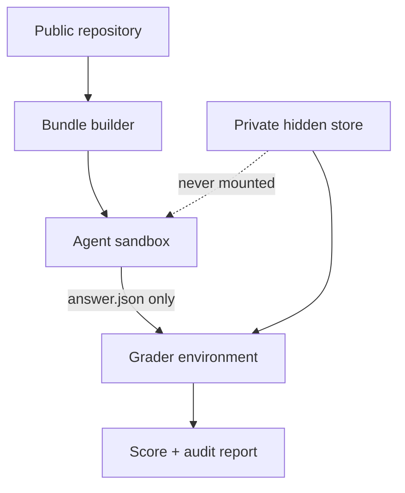

# Architecture

## Design goals

EvoLDO-Bench is designed around six constraints:

1. **Originality:** no external benchmark materials are copied or adapted.
2. **Capability resolution:** scores remain separable by structure, trend, diagnosis, sizing, migration,
   system impact, and design closure.
3. **Determinism first:** graph, numerical, policy, and qualification facts are code-graded.
4. **Treatment comparability:** direct, skill, and simulator runs share the same final answer contract.
5. **Evidence integrity:** all results bind task files, answer, environment, mode, and code revision.
6. **Air-gap portability:** the reference core is standard-library-only and supports Python 3.9.

## Data planes

### Public task plane

A task directory contains only:

- `task.json`;
- `prompt.md`;
- `inputs/*`;
- `answer_template.json`.

`build_runtime_bundle` copies this minimal set and optionally a frozen context/skill directory. It rejects
well-known oracle/golden/rubric names. The resulting manifest records SHA-256 hashes.

### Oracle plane

The grader reads oracles from a separate root. Public development oracles live in `dev_reference` for
infrastructure testing. Validation/test/sealed oracles must live outside the repository and outside the
agent mount namespace.

### Result plane

The agent writes only `answer.json` plus optional permitted artifacts in future design modes. The runner
records command status and provenance. The grader produces task score objects. The aggregator macro-
averages families before constructing suite and level scorecards.

## Components

| Module | Responsibility |
|---|---|
| `contracts.py` | strict task, answer, oracle, and probe validation |
| `discovery.py` | task discovery, duplicate-ID protection, inventory |
| `bundle.py` | minimal runtime bundle and forbidden-file audit |
| `runner.py` | timeout-bounded command execution and provenance |
| `graders/deterministic.py` | exact/set/numeric checks and critical caps |
| `grading.py` | external-oracle resolution and batch grading |
| `aggregate.py` | family macro, suite/level vectors, treatment lift |
| `contamination.py` | split lineage, leak, identity, and similarity guardrails |
| `report.py` | human-readable Markdown scorecard |

## Trust boundaries

The reference Python runner does not create an operating-system sandbox. Production exam infrastructure
must enforce that boundary with containers, VMs, remote workers, or a site-specific adapter.

## Extension points

Future adapters should implement stable envelopes rather than modify graders per task:

- `AgentAdapter`: invoke a model/agent with the same runtime bundle;
- `ToolAdapter`: expose a uniform simulator API after validating `AnalogProbeContract`;
- `SiteAdapter`: map public design contracts to an approved site EDA/PDK stack;
- `QualificationAdapter`: normalize OP, startup, STB, PSRR, noise, transient, and policy evidence;
- `ExplanationJudgeAdapter`: evaluate prose only after human calibration.

Per-task routing tables are forbidden in paired treatment comparisons because they encode answer strategy.
