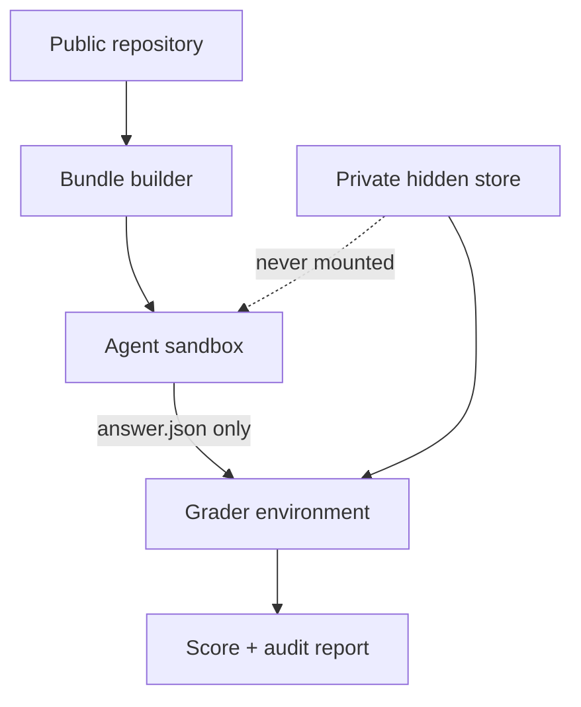

# Architecture

## Design goals

EvoLDO-Bench is designed around six constraints:

1. **Originality:** no external benchmark materials are copied or adapted.
2. **Capability resolution:** scores remain separable by structure, trend, diagnosis, sizing, migration,
   system impact, and design closure.
3. **Determinism first:** graph, numerical, policy, and qualification facts are code-graded.
4. **Treatment comparability:** direct, skill, and simulator runs share the same final answer contract.
5. **Evidence integrity:** all results bind task files, answer, environment, mode, and code revision.
6. **Air-gap portability:** the reference core is standard-library-only and supports Python 3.9.

## Data planes

### Public task plane

The canonical v0.6 package has only `task.toml`, `instruction.md`, `environment/`, `tests/`, and
`solution/` at its top level, matching the supplied `task_examples` demos. Detailed task contract,
case, answer template, and approved tools live under `environment/starter`. `build_runtime_bundle` copies
only the starter contents and instruction; it never copies tests, solutions, or external oracles. Legacy
v0.5 `task.json` packages remain readable for result replay but are not the default benchmark.

### Oracle plane

The grader reads oracles from a separate root. Public development oracles live in `dev_reference` for
infrastructure testing. Validation/test/sealed oracles must live outside the repository and outside the
agent mount namespace.

### Result plane

The agent writes only `answer.json` plus optional permitted artifacts in future design modes. The runner
records command status and provenance. The grader produces task score objects. The aggregator macro-
averages families before constructing suite and level scorecards.

### Public-PDK closure plane

The SKY130 track is deliberately separate from prompt/oracle scoring. A task contributes a faulty starter,
a frozen testbench template, process/temperature scenarios, and numeric limits. `public_pdk.py` copies one
candidate into an isolated run directory, renders only the pinned model path/corner/temperature, runs
ngspice, and binds candidate, deck, and log hashes into each evidence digest. Model files are fetched into
an ignored runtime checkout and must match the pinned source commit and entry-file hash.

## Components

| Module | Responsibility |
|---|---|
| `contracts.py` | strict task, answer, oracle, and probe validation |
| `discovery.py` | task discovery, duplicate-ID protection, inventory |
| `bundle.py` | minimal runtime bundle and forbidden-file audit |
| `runner.py` | timeout-bounded command execution and provenance |
| `experiment.py` | immutable context snapshots, repeated rollouts, paired-treatment controls |
| `probes.py` | semantic probe-policy gate and anti-confounding checks |
| `adapters.py` | model, simulator, ngspice, and private-site interfaces |
| `telemetry.py` | token/cost/cache/tool/time normalization and confidence intervals |
| `graders/deterministic.py` | exact/set/numeric checks and critical caps |
| `grading.py` | external-oracle resolution and batch grading |
| `aggregate.py` | family macro, Pass@1/spec score, suite vectors, lift and harm |
| `contamination.py` | split lineage, leak, identity, and similarity guardrails |
| `calibration.py` | two-judge calibration and disagreement routing |
| `qualification.py` | immutable candidates and fresh hard-gate evidence |
| `public_pdk.py` | SKY130 task validation, DUT policy scan, ngspice replay, measurement/spec classification |
| `exam.py` | frozen release manifests and verification |
| `leaderboard.py` | static JSON/CSV/HTML score-versus-effort artifacts |
| `report.py` | human-readable Markdown scorecard |
| `live_verify.py` | trusted SKY130/ngspice and IC618/SKILL gates with infrastructure attribution |

## Trust boundaries

The reference Python runner does not create an operating-system sandbox. Production exam infrastructure
must enforce that boundary with containers, VMs, remote workers, or a site-specific adapter.

## Extension points

Future adapters should implement stable envelopes rather than modify graders per task:

- `AgentAdapter`: invoke a model/agent with the same runtime bundle;
- `ToolAdapter`: expose a uniform simulator API after validating `AnalogProbeContract`;
- `SiteAdapter`: map public design contracts to an approved site EDA/PDK stack;
- `QualificationAdapter`: normalize OP, startup, STB, PSRR, noise, transient, and policy evidence;
- `ExplanationJudgeAdapter`: evaluate prose only after human calibration.

Per-task routing tables are forbidden in paired treatment comparisons because they encode answer strategy.

`AgentAdapter`, `SimulatorAdapter`, and `SiteAdapter` are now implemented interfaces. The public repository
ships a command agent, JSON process simulator, optional ngspice batch wrapper, and analytic protocol
fixture. It deliberately does not ship a private-site adapter or private PDK content.

## Control plane

Each experiment freezes the context tree, task/answer hashes, model ID, rollout index, seed, and budget.
`compare-treatments` rejects a causal lift comparison when any control field drifts. Tool calls are valid
only when they appear in the normalized ledger and pass the task's probe policy. A host sandbox is still
required to prevent an untrusted process from bypassing the declared tool gateway.

## Candidate plane

A design candidate is a content-addressed artifact tree. Qualification evidence names one hard gate and
the exact candidate digest. Stale evidence is never inherited across candidates. A site adapter may map
this contract to an approved simulator/PDK stack, but site identifiers and assets remain outside the public
repository.

The public-PDK runner is not a generic shell gateway. It accepts one candidate netlist, rejects top-level
bench content and hidden includes, and distinguishes `INFRA_FAIL`, `MEAS_FAIL`, `POLICY_FAIL`, and
`CIRCUIT_FAIL`. The model checkout is a runtime dependency rather than benchmark content.
